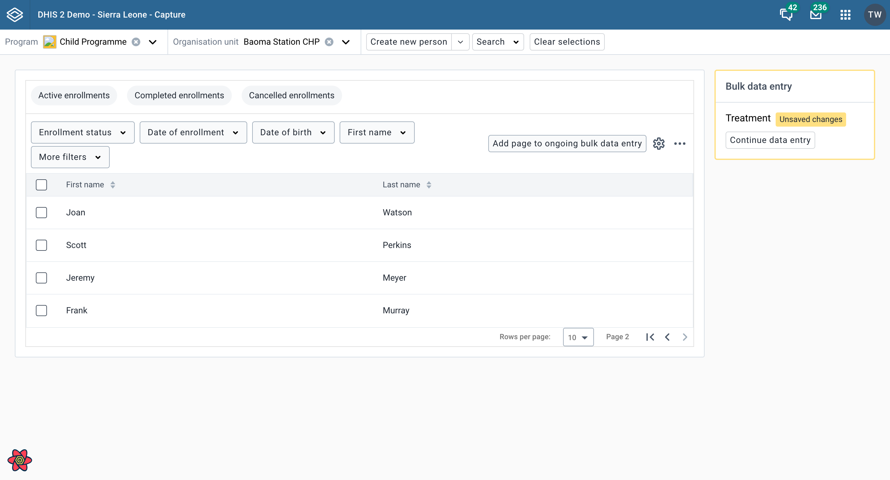

To enable bulk data entry functionality, you need to configure the data store in your DHIS2 instance. Follow these steps:

1. Access your DHIS2 Data Store Management app
2. Create a new key called `bulkDataEntry` in the `capture` namespace
3. The data store interface should look similar to this:


## Configuration Structure

In the `bulkDataEntry` key you created, you can store your bulk data entry form configurations. The structure is as follows:

```json title="capture/bulkDataEntry"
{
    "version": 1,
    "config": []
}
```

The `version` field indicates the configuration version as a number. The `config` array contains one or more bulk data entry configuration objects. Below is an example showcasing three different configurations:

```json title="capture/bulkDataEntry"
{
    "version": 1,
    "config": [
        {
            "title": {
                "en": "Routine visit"
            },
            "dataKey": "routineVisit",
            "subtitle": {
                "en": "Covers all patient visit forms"
            },
            "configKey": "routineVisit",
            "programId": "IpHINAT79UW",
            "pluginSource": "https://debug.dhis2.org/dev/api/apps/routine-visit/plugin.html"
        },
        {
            "title": {
                "es": "Tratamiento",
                "en": "Treatment",
                "fr": "Traitement",
                "nb": "Behandling"
            },
            "configKey": "treatment",
            "programId": "IpHINAT79UW",
            "pluginSource": "https://debug.dhis2.org/dev/api/apps/treatment/plugin.html"
        },
        {
            "title": {
                "en": "Case based surveillance"
            },
            "subtitle": {
                "en": "Covers ad-hoc visits and RMNCH238972"
            },
            "configKey": "caseBasedSurveillance",
            "programId": "uy2gU8kT1jF",
            "pluginSource": "https://debug.dhis2.org/dev/api/apps/case-based-surveillance/plugin.html"
        }
    ]
}
```

### Configuration Fields

Each configuration object requires the following fields:

| Field | Required | Description |
|-------|----------|-------------|
| `configKey` | Yes | An identifier for the configuration. Must be unique per `programId`. Will be passed to the plugin. |  
| `programId` | Yes |  The identifier of the program where this bulk data entry will be available. |
| `pluginSource` | Yes | The URL of the plugin. Must point to a valid plugin installed on the instance and follow the pattern: https://{instance-url}/api/apps/{plugin-name}/plugin.html. |
| `title` | Yes | The display title of the configuration. Supports multiple languages using locale codes (e.g., "en", "es"). |
| `subtitle` | No | An optional subtitle for the configuration. Supports multiple languages using locale codes. |
| `dataKey` | No | An optional identifier that is not used internally by the app but is passed through to the plugin. This property is intended for advanced usage and can be used by the plugin to maintain separate in-progress caches for a given `configKey`. |

## Selecting a Plugin Configuration

Once configured, bulk data entry plugins are accessible in multiple locations throughout the Capture app. You'll find them displayed as widgets on both the Program overview and Search pages:


The plugins can also be accessed via dropdown menus from the tracked entities working lists or the program stages working lists:


After the user selects a plugin configuration, it is stored in `IndexedDB` for the duration of use.

### Passing Tracked Entities to the Plugin

The plugin receives tracked entities through the `trackedEntityIds` prop - an array containing the IDs of selected tracked entities.

### Cleanup and Disposal

To exit the Plugin and return to the Program overview or Search pages, use the `onDefer` function provided as a prop. This will place the Plugin in an idle state until further action is taken.




To ensure proper cleanup and resource management, use the `onComplete` function provided as a prop to close the plugin. This will clear the selected configuration from `IndexedDB`.
