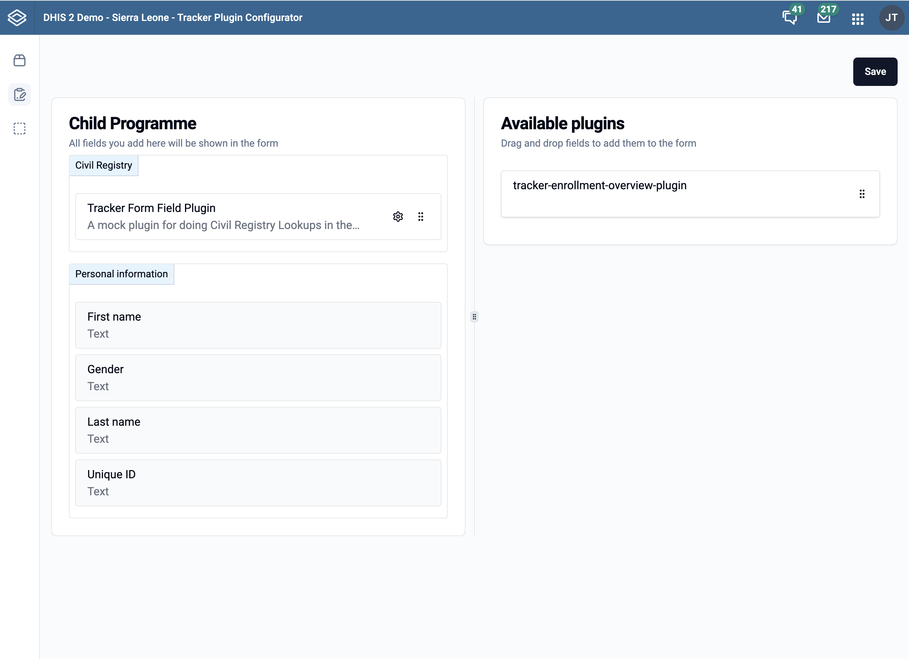

import Logo from './resources/tracker-plugin-configurator-logo.png'

# Configuration

---

One of the developers in the DHIS2 Core development team has created an application that allows you to configure a Capture plugin in the DHIS2 Capture app.

This application is called __Tracker Plugin Configurator__ and is available in the [DHIS2 App Hub](https://apps.dhis2.org/app/85d156b7-6e3f-43f0-be57-395449393f7d).

The app is also installable from the App Management app in your DHIS2 instance.

### How to use the Tracker Plugin Configurator

1. Open the Tracker Plugin Configurator app.
2. Select the page for either the form field or enrollment plugin type.
3. Select the program you want to configure the plugin for.
4. Drag and drop until you are satisfied with the layout.
    1. To add a plugin, it needs to be installed and available in the DHIS2 instance.
    2. Either install it from the App Hub or upload the bundled file to the app management app.
5. Click the save button to save the configuration to the data store.

 

### Important: Keeping configurations in sync with metadata

The plugin configuration saved by the Tracker Plugin Configurator is stored in the DHIS2 data store (`capture` namespace). This configuration is a snapshot of your program's metadata at the time you saved it - it includes references to specific tracked entity attributes, data elements, sections, and field mappings.

**If you make changes to the underlying program metadata** (for example, adding or removing attributes, changing sections, adding new program stages, or modifying data elements), **the plugin configuration in the data store will not automatically update to reflect those changes.**

This means that after making metadata changes to a program that has a plugin configured, you must manually re-open the Tracker Plugin Configurator and update the configuration. Failing to do so may result in:

- New fields not appearing in plugin-configured forms
- Removed fields still being referenced in the configuration
- Section changes not being reflected in the form layout
- Plugins not receiving the correct field mappings

:::tip
After making any metadata changes to a program with plugins configured, always re-open the Tracker Plugin Configurator app for the affected program and re-save the configuration to ensure it stays in sync.
:::

