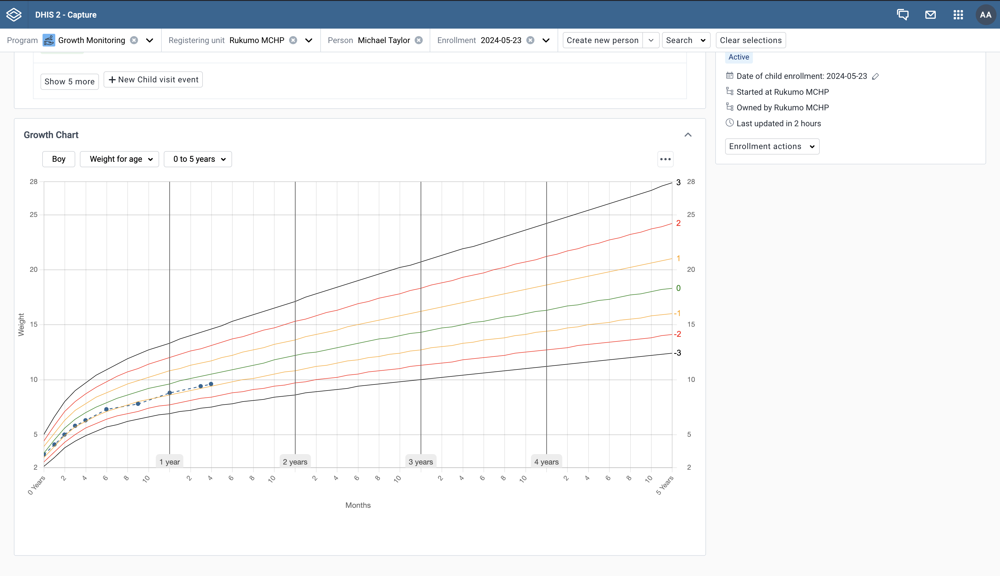

The Capture app offers a way to extend the enrollment pages with custom layouts or plugins. This allows you to customize the layout of the enrollment pages to fit your needs.

An Enrollment plugin is a type of plugin in the Capture app that is designed to extend the functionality of our enrollment pages.
It will typically be used for adding custom widgets or components to the page. 

Some use-cases include:

1. Displaying data in a custom way
2. Safely displaying and syncing data from external sources
3. Extend the dashboard with custom visualizations and analytics
4. Whatever you can imagine!

## Examples

---

### WHO Growth Chart

You can use an enrollment plugin to display a WHO Growth Chart on the enrollment dashboard.
The WHO Growth Chart is a standard tool used to monitor the growth of children and can be used to track the progress of a child over time.
Using a WHO Growth Chart plugin can help to visualize the growth of a child and ensure that they are growing at a healthy rate.

Check out the official [WHO Growth Chart Plugin](https://apps.dhis2.org/app/09f48f78-b67c-4efa-90ad-9ac2fed53bb8) on the App Hub.

