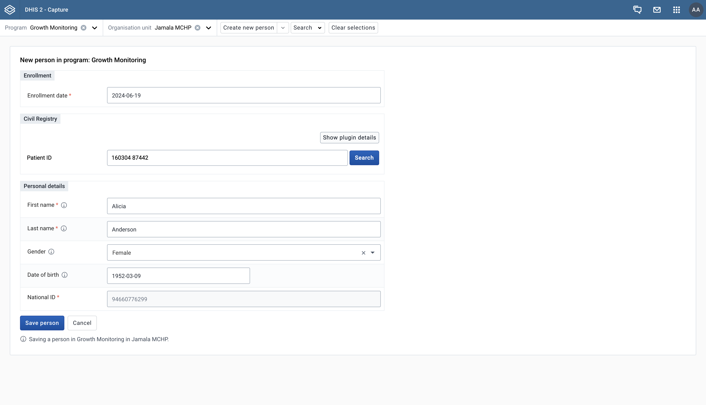

Form Field Plugins are a type of plugin in the Capture app that are designed to extend the functionality of our native forms.
They are injected directly into the form and can be used for a variety of purposes, such as:
1. Adding custom fields
2. Fetching data from external sources
3. Custom validations
4. Whatever you can imagine!

## Examples

---

### Civil registry integration

You can use a form field plugin to make external API calls to any existing service, such as a civil registry.
A civil registry is a government record of vital events, such as births, deaths, and marriages, and can be used to look up information about a person.
Using a civil registry plugin can help to automatically populate fields in the form with data from the registry, ensure that there are no duplicate records in your system, and reduce the amount of manual data entry required.

Check out the [Mock Civil Registry Plugin](https://github.com/eirikhaugstulen/civil-registry-plugin) for an example of how this could be implemented.

---

### ICD-10 / ICD-11

You can use a form field plugin to integrate with external services, such as the International Classification of Diseases (ICD-11).
ICD-11 is a global standard for diagnostic health information and can be used to classify diseases and other health problems.
Using an ICD-11 plugin can help to ensure that the data entered into the form is standardized and follows a common classification system.

There are currently no developed plugins for ICD-11, but we would be happy to help you get started!

---
