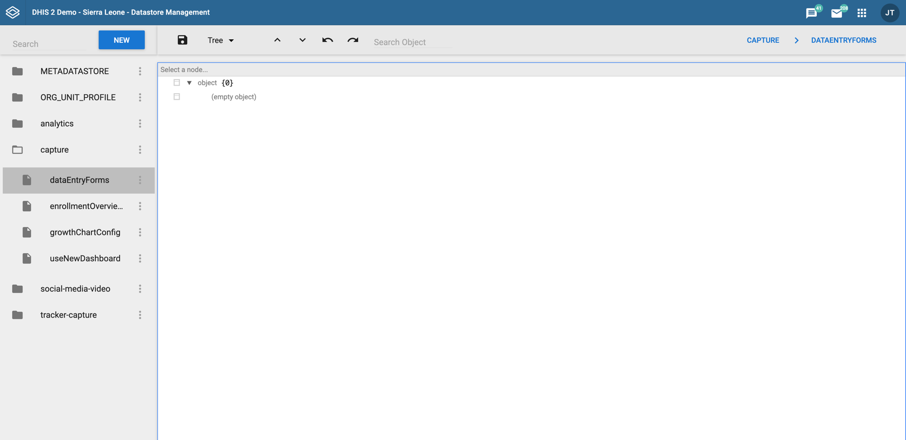
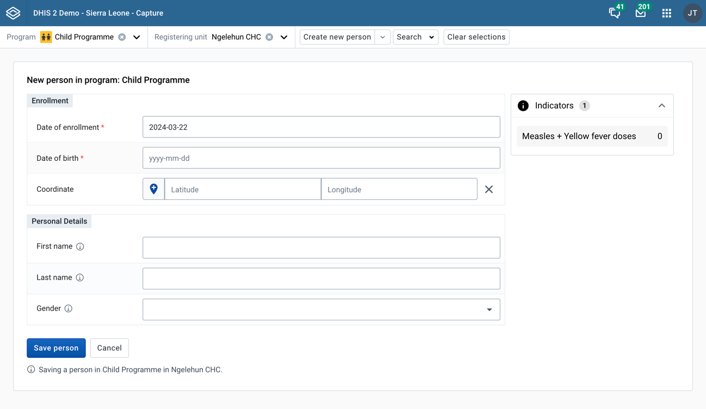
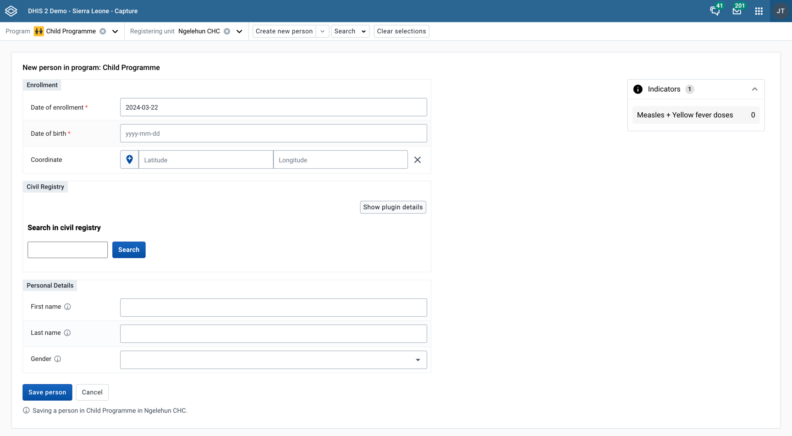

---
:::warning Experimental feature
We discourage setting up plugins manually, as it is a complex process that can lead to errors.
We recommend using the Tracker Configurator App to set up plugins. This will ensure that the plugins are correctly configured and that they work as expected.
:::

## Configuring the data store

Make sure you have a key called `dataEntryForms` in your capture namespace. Your data store management app will look something like this:




## Defining a form configuration

The form configuration is a JSON object that defines the structure of the form. It is used to define the layout and what fields the plugin should have access to.

1. Let's start by defining which form this configuration should be used for. We will put the following JSON in the `dataEntryForms` key that we created earlier. We will use the ID of the SL Child Programme as an example:

```json title="capture/dataEntryForms"
{
    "IpHINAT79UW": [
      
    ]
}
```
:::info What does this ID mean?
This is the ID of the context that the form is being used in. In this case, it is the ID of the program that the form is being used for, and you can find this ID by looking at the URL of the Capture app.
- **Program ID ->** *Registration form* (the form that shows up when enrolling a new tracked entity instance)
- **Program Stage ID ->** *New event in program stage*
- **Tracked Entity Type ID ->** Tracked entity type form (the form that shows up when registering a new tracked entity instance without a program)
:::

2. Now let's our first section of the form by adding an object to the array. This object should have an `id` and a `name` property. The `id` is a unique identifier for the section, and the `name` is the title of the section. We will also add an `elements` array to the section object, which will contain the fields that we want to add to the form.

```json title="capture/dataEntryForms" showLineNumbers
{
    "IpHINAT79UW": [
      {
        "id": "some-random-id",
        "name": "First section",
        "elements": []
      }
    ]
}
```

3. Now let's add our first field to the form. Each object in the elements array will represent an element in the form. There are currently two types of elements supported: `TrackedEntityAttribute` and `plugin`. We will start by adding a `TrackedEntityAttribute` element to the form. This element will be used to capture the first name of the tracked entity instance.

```json title="capture/dataEntryForms" showLineNumbers
{
    "IpHINAT79UW": [
      {
        "id": "some-random-id",
        "name": "Personal Details",
        "elements": [
        // highlight-start
          {
            "type": "TrackedEntityAttribute",
            "id": "w75KJ2mc4zz"
          }
        // highlight-end
        ]
      }
    ]
}
```


4. Finally, let's add the other the rest of the fields needed for the Child Programme.

```json title="capture/dataEntryForms" showLineNumbers
{
    "IpHINAT79UW": [
      {
        "id": "some-random-id",
        "name": "Personal Details",
        "elements": [
          {
            "type": "TrackedEntityAttribute",
            "id": "w75KJ2mc4zz"
          },
          // highlight-start
          {
            "id": "zDhUuAYrxNC",
            "type": "TrackedEntityAttribute"
          },
          {
            "id": "cejWyOfXge6",
            "type": "TrackedEntityAttribute"
          }
          // highlight-end
        ]
      }
    ]
}
```

:::info
If you have followed the steps correctly, your Capture app form should look something like this:


:::

## Adding a plugin to the form

Now that we have defined the structure of the form, we can add a plugin to the form.

1. Let's start by defining a new section on top of the already existing one. In this example, we will add the example plugin that mocks the functionality of a Civil Registry lookup.
You can get the example plugin [here](https://github.com/eirikhaugstulen/tracker-form-field-plugin)

```json title="capture/dataEntryForms" showLineNumbers
{
  "IpHINAT79UW": [
    {
      "id": "some-random-id-2",
      "name": "Civil Registry",
      "elements": []
    }
    //...Rest of the config goes here
  ]
}
```

2. Now let's add the plugin to the form. Instead of using the type `TrackedEntityAttribute`, we will use the type `plugin`. This type will tell the Capture app that this element is a plugin and that it should be rendered as such.

```json title="capture/dataEntryForms" showLineNumbers
{
  "IpHINAT79UW": [
    {
      "id": "some-random-id-2",
      "name": "Civil Registry",
      "elements": [
        // highlight-start
        {
          "type": "plugin",
          "id": "some-random-id-3",
          "pluginSource": "https://{instance-url}/api/apps/{name-of-plugin}/plugin.html",
          "fieldMap": []
        }
        // highlight-end
      ]
    }
    //...Rest of the config goes here
  ]
}
```

As you can see, the `plugin` element has a `pluginSource` property that points to the URL of the plugin.
This URL should point to the plugin that you have created and uploaded to the App Management app.
It also has a `fieldMap` property. This is very important, as it tells the plugin which fields it should have access to.

3. Let's add the fields that the plugin should have access to.

```json title="capture/dataEntryForms" showLineNumbers
{
  "IpHINAT79UW": [
    {
      "id": "some-random-id-2",
      "name": "Civil Registry",
      "elements": [
        {
          "type": "plugin",
          "id": "some-random-id-3",
          "pluginSource": "https://{instance-url}/api/apps/{name-of-plugin}/plugin.html",
          "fieldMap": [
            // highlight-start
            {
              "IdFromApp": "w75KJ2mc4zz",
              "IdFromPlugin": "firstName",
              "objectType": "TrackedEntityAttribute"
            },
            {
              "IdFromApp": "zDhUuAYrxNC",
              "IdFromPlugin": "lastName",
              "objectType": "TrackedEntityAttribute"
            },
            {
              "IdFromApp": "cejWyOfXge6",
              "IdFromPlugin": "gender",
              "objectType": "TrackedEntityAttribute"
            }
            // highlight-end
          ]
        }
      ]
    }
    //...Rest of the config goes here
  ]
}
```

:::info What does this mean?
We have now defined three fields that the plugin should have access to, but what does this object mean?
- `IdFromApp` is the ID of the field in your DHIS2 system
- `IdFromPlugin` is the ID of the field in the plugin
- `objectType` property tells the plugin what type of object it is interacting with.

The `IdFromPlugin` property is the id the plugin uses to identify the field. This has been made dynamic as generic plugins will be used on multiple DHIS2 instances and implementations. This `fieldMap` is used to map the fields your DHI2 instance to the fields used in the plugin.
There is no limit to how many fields you can map, and you can currently use to types of objects: `TrackedEntityAttribute` and `Attribute`. (Custom attributes that can be associated with any metadata object)
:::

4. **Great!** Now you have added a plugin to your form. If you have followed the steps correctly, your Capture app form should look something like this:


## Examples

Here's the full configuration for the form with the plugin added:

```json title="capture/dataEntryForms" showLineNumbers
{
  "IpHINAT79UW": [
    {
      "id": "some-random-id-2",
      "name": "Civil Registry",
      "elements": [
        {
          "id": "some-random-id-3",
          "type": "plugin",
          "pluginSource": "http://localhost:8080/api/apps/tracker-form-field-plugin/plugin.html",
          "fieldMap": [
            {
              "IdFromApp": "w75KJ2mc4zz",
              "IdFromPlugin": "firstName",
              "objectType": "TrackedEntityAttribute"
            },
            {
              "IdFromApp": "zDhUuAYrxNC",
              "IdFromPlugin": "lastName",
              "objectType": "TrackedEntityAttribute"
            },
            {
              "IdFromApp": "cejWyOfXge6",
              "IdFromPlugin": "gender",
              "objectType": "TrackedEntityAttribute"
            }
          ]
        }
      ]
    },
    {
      "id": "some-random-id",
      "name": "Personal Details",
      "elements": [
        {
          "id": "w75KJ2mc4zz",
          "type": "TrackedEntityAttribute"
        },
        {
          "id": "zDhUuAYrxNC",
          "type": "TrackedEntityAttribute"
        },
        {
          "id": "cejWyOfXge6",
          "type": "TrackedEntityAttribute"
        }
      ]
    }
  ]
}
```

## FAQ and Troubleshooting

<details>
    <summary>
        The plugin is not showing up in the form
    </summary>
    <div>
        <p>
            This can be caused by a number of issues. Here are some things you can check:
        </p>
        <ul>
            <li>Make sure that the plugin is hosted on a server that is accessible from the app</li>
            <li>Make sure that the plugin configuration has the correct id to the context that the form is being used in</li>
            <li>Make sure you have actually uploaded the plugin to the App Management app</li>
        </ul>
    </div>
</details>

<details>
    <summary>I'm getting a CORS error when trying to load the plugin</summary>
    <div>
        <p>
            This is a common issue when trying to load a plugin from a different domain than the one the app is running on.
            In general, it is better to keep both the app and the plugin on the same domain. For development purposes, you can use a browser extension to disable CORS.
            It has also shown to be helpful to use firefox for development purposes, as it is less strict when it comes to CORS.
            In production, you should always make sure that the plugin is hosted on the same domain as the app.
        </p>
    </div>
</details>
